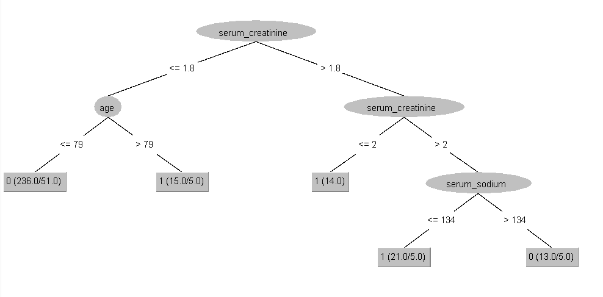
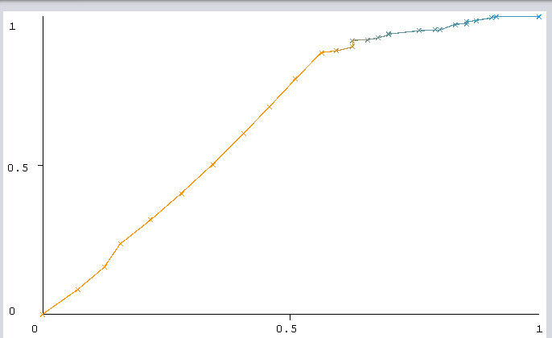

```{r setup, include=FALSE}
knitr::opts_chunk$set(echo = TRUE)
options(warn=-1)
```

```{r, message = FALSE, echo = FALSE}

# Load all necessary libraries

library("reshape2")
library("cowplot")
library("ggplot2")
library("dplyr")
library("ggfortify")
library("dplyr")
library("tibble")
library("factoextra")
```

# Introduction

The dataset \cite{MLR} analyzed for this research contains the medical records of 299 heart failure patients collected at the Faisalabad Institute of Cardiology and at the Allied Hospital in Faisalabad (Punjab, Pakistan), during April–December 2015. The patients consisted of 105 women and 194 men, and their ages range between 40 and 95 years old. All patients had left ventricular systolic dysfunction which puts them on a higher risk of death, this needs to be kept in mind when looking at the data.

Heart failure is quite common, and thus affects a lot of people each year. The condition is the leading cause of hospitalization in people over age 65. One solution might be to prevent heart failure from happening by examining large datasets full of data which are known to relate (closely) to heart disease and/or heart failure. This research is trying to replicate this solution with a supplied dataset.

The question this research is aiming to give an answer to is:
"Can a death event be predicted when blood serum and age data is given using machine learning techniques?"

```{r, echo = FALSE, message = FALSE}

# Read the data and change the age column to a correct datatype
data <- read.csv(file = "data/heart_failure_clinical_records_dataset.csv")
data$age <- as.integer(data$age)
```

# Cleaning data

Before the data can be used by a Machine Learning algorithm, the data needs to be cleaned:

The datatypes, readability and reproducibility are very important in an EDA. This is why the function 'mutate' comes in handy. The 0,1 structure will be replaced by "False/True" to make the readability better and also increase the reproducibility. Finally, tibble will be used to give the 'head' of the data is table. As seen in the table below, the data has labels and no missing values at all.

```{r, echo = FALSE}
factored_data <- data %>% mutate(sex = factor(sex, levels = c(0,1), labels = c("F","M")),
                        anaemia = factor(anaemia, levels = c(0,1), labels = c("False","True")),
                        DEATH_EVENT = factor(DEATH_EVENT, levels = c(0,1), labels = c("False","True")),
                        smoking = factor(smoking, levels = c(0,1), labels = c("False","True")),
                        diabetes = factor(diabetes, levels = c(0,1), labels = c("False","True")),
                        high_blood_pressure = factor(high_blood_pressure, levels = c(0,1), labels =
                        c("False","True")))

```

# Material and methods

For the exploratory data analysis, R and Markdown have been used. The version of R is 4.0.4, R has been used as tool for Markdown. R is a programming language used for statistics and data analysis. Graphs and plots can be easily created, so this program is ideal for a research like this. The graphs were made via the ggplot2 library. dplyr and tidyr were also used as additional tools for data transformation. 

All code for the data analysis and workflow can be found in the log.
The log can be found via github on: https://github.com/JurrienDeJong/Heart-Failure-Prediction.

Next, a Java application, which takes known heart data and creates a J48 model based on the model chosen for this research has been created. When a batch file of unknown instances, or a single instance is fed to the file, it will classify all of the instances. So it will result in true or false ( dead or alive ).

For the wrapper application, the programming language Java has been used. The Java wrapper is made and tested on Java version 16. Via the command line, a patient's age, serum creatinine and serum sodium value can be given.

The Java wrapper also uses multiple dependencies, the common CLI version 1.4 for command line arguments. And the Weka stable version 3.8.5 was used for making the instance object, preparing this object and using the model to classify. Classifying the user's instance and showing this in the terminal output. 

The main wrapper page can be found on: https://github.com/JurrienDeJong/JavaWrapper, and for the exact classes on: https://github.com/JurrienDeJong/JavaWrapper/tree/main/src/main/java/nl/bioinf/wrapper

Readme and support ( for both the JavaWrapper and the log ) can be directly found on: https://github.com/JurrienDeJong/JavaWrapper/blob/main/README.txt and,
https://github.com/JurrienDeJong/Heart-Failure-Prediction/blob/main/README.txt

# Results

First, let's try to answer the research question by creating plots. An EDA process contains plenty of different methods of exploring the data. In this section those results will be shown.

It is very important to check if the data contains major outliers or maybe even typos. This could be dramatic to the results/conclusions of the research. By creating boxplots, outliers can be visible outside the 'box' as dots:

```{r, echo = FALSE}
b1 <- ggplot(factored_data, aes(y=serum_creatinine)) + 
      geom_boxplot() +
      labs(caption = "Boxplot showing serum creatinine \ndata distribution") +
      ylab("Serum creatinine (in mg/dL)")

b2 <- ggplot(factored_data, aes(y=serum_sodium)) + 
      geom_boxplot() +
      labs(caption = "Boxplot showing serum sodium \ndata distribution") +
      ylab("Serum sodium (in mEq/L)")

b3 <- ggplot(factored_data, aes(y=age)) + 
      geom_boxplot() +
      labs(caption = "Boxplot showing age ]data distribution") +
      ylab("Age ( in years )")

plot_grid(b1, b2, NULL, b3, labels = c("A","B","","C"),
          label_size = 12,
          label_x = 0.9,
          label_y = 0.85,
          hjust = 0,
          vjust = 0,
          label_fontfamily = "serif",
          label_fontface = "plain",
          label_colour = "dark blue")
```

As seen in figure A above, the data contains many outliers. A normal serum creatinine value ranges between 0.59 and 1.35 mg/dL while the data contains values which are close to 10. Taken into account that the patients who have taken part in this research have underlying heart/renal conditions, these values are acceptable. This trend is also visible in figure B, while the range of the outliers is much smaller than figure A. The normal serum sodium level ranges between 135 and 145 milliequivalents per liter (mEq/L). As seen in figure B some outliers have much lower sodium values, this could be quite harmful to the heart because decreased sodium can cause muscle dysfunction and ultimately heart failure. The age boxplot seen in figure C shows normally distributed data. This can be supported by the fact that people get examined more as they get older because key body functions, like muscle- and renal function, will on average deteriorate over time.

# Relationship between attributes

It is important to get to know what kind of relationship there is between the variables. Let's first 'cut out' the part of the data which will be used for the research. The serum and age data will be used, which are from columns 1,8 and 9 because the age, serum creatinine and serum sodium values have a great impact on heart disease and renal dysfunction, as seen in \cite{BMC}. Below the relations are plotted in graphs:

```{r, echo = FALSE, message= FALSE}
# Get the columns we will use for this research
used_data <- factored_data[,c(1,8,9)]
```

```{r, echo = FALSE, message = FALSE}

# Chose good visual colors
myColors <- c("#746AB0", "#E83845")

#### Serum Creatinine ####

p1 <- ggplot(data = factored_data, aes(x = age, y = serum_creatinine, colour = DEATH_EVENT)) + 
      xlab("Age ( in years )") + 
      ylab("Serum creatinine ( in mg/dL )") +
      labs(caption = "The relations between age, serum creatinine and if the 
           person died during follow-up") +
      geom_point(alpha = 0.75) + 
      scale_color_manual(values=myColors) + 
      geom_jitter(width = 0.3) + 
      geom_smooth(method = "loess", formula = y ~ x) +
      labs(col = "Death during follow-up")

#### Serum Sodium ####

p2 <- ggplot(data = factored_data, aes(x = age, y = serum_sodium, colour = DEATH_EVENT)) + 
      xlab("Age ( in years )") + 
      ylab("Serum sodium ( in mEq/L )") +
      labs(caption = "The relations between age, serum sodium and if the 
           person died during follow-up") +
      geom_point(alpha = 0.75) + 
      scale_color_manual(values=myColors) + 
      geom_jitter(width = 0.3) + 
      geom_smooth(method = "loess", formula = y ~ x) +
      labs(col = "Death during follow-up")

plot_grid(p1,p2,ncol=1, labels = "AUTO",
          label_size = 12,
          label_x = 0.8,
          label_y = 0.9,
          hjust = 0,
          vjust = 0,
          label_fontfamily = "serif",
          label_fontface = "plain",
          label_colour = "dark blue")
```

As mentioned before, a higher serum creatinine count or a lower serum sodium count than normal can result in heart failure. The literature found was correct as seen in the plot above. Figure A shows an increased death chance if the creatinine value is higher than 0.125 mg/dL and figure B shows an increased death chance if the sodium drops below 135 mEq/L.

## Density

A density plot can be used to help display where values are concentrated over the interval. For this instance the interval is the amount of creatinine or sodium in the blood serum. To illustrate which concentration seems fatal, two density plots have been created, and colored based on the outcome of the follow-up period:

```{r, echo = FALSE, message= FALSE}
d1 <- ggplot(factored_data, aes(x=serum_creatinine)) +
    geom_density(aes(color = DEATH_EVENT)) +
    labs(colour = "Death Event") +
    xlab("Serum creatinine ( in mg/dL )") +
    ylab("Density") +
    scale_color_manual(values=c("#9992FF", "#DD6755"))

d2 <- ggplot(factored_data, aes(x=serum_sodium)) +
    geom_density(aes(color = DEATH_EVENT)) +
    labs(colour = "Death Event") +
    xlab("Serum sodium ( in mEq/L )") +
    ylab("Density") +
    scale_color_manual(values=c("#9992FF", "#DD6755"))

plot_grid(d1,d2,ncol=1, labels = "AUTO")
```

Just like the dotplot before, the density plot shows that a lower serum sodium value seems more fatal, as is a slightly higher serum creatinine value. The difference in frequency of figure B does seem more convincing than figure A.

## Correlation

The correlation is an extremely important factor in machine learning because ML algorithms assume that all attributes are independent. When looking at the heatmap below, 3 attributes stand out. At first, the follow-up time has a very negative correlation to the class attribute. The serum sodium has a somewhat negative correlation while the serum creatinine shows that there is a positive correlation between it and death event. So concluded, both values have differing correlation with the death event attribute which means they are independent.

```{r, echo = FALSE, message= FALSE}

cormat <- round(cor(data),2)
melted_cormat <- melt(cormat)

ggplot(data = melted_cormat, aes(x=Var1, y=Var2, fill=value)) + 
  geom_tile() +  
    scale_fill_gradient2(low = "#075AFF",
                       mid = "#FFFFCC",
                       high = "#FF0000") +
  theme(axis.text.x  = element_text(angle=90, vjust=0.5)) +
  coord_fixed() +
  xlab("") +
  ylab("") +
  labs(caption = "Heatmap showing the correlation between \nheart failure attributes")
```

A heatmap visualizing the correlation between all heart value attributes. The red in the diagonal can be ignored because it represents a correlation of one variable instead of two. When the color of a tile is close to white there is no to near minimal correlation between attributes. If the tile is blue colored, there is a negative correlation present, while a red color indicates a positive correlation.


## Clustering

Clustering can be a great tool to give a better understanding of the data by discovering patterns. Below, a k-means cluster of 2 will be performed. A k of 2 has been chosen because the death event attribute has 2^1 possibilities.

```{r, echo = FALSE, message = FALSE}
# Compute k-means with k = 3
set.seed(123)
res.km <- kmeans(scale(used_data), 2, nstart = 25)

fviz_cluster(res.km, data = used_data,
             palette = c("#DD6755","#9992FF"), 
             geom = "point",
             ellipse.type = "convex", 
             ggtheme = theme_bw(),
             main = "Cluster of heart failure data using k = 2"
             )
```

In the plot above there can clearly be seen that two independent clusters have been formed with the given data. The most right cluster in blue represents the patients who survived while the red cluster shows the patients which died during follow-up. There is however a small section visible where the two clusters overlay, which means that it is not certain what the result will be for patients inside that range.

Next a PCA cluster plot will be created. It is quite similar to the k-means cluster, so the result will most likely be the same. It shows clusters of samples based on their similarity, which gives a good indication for independent values. PCA is mostly used to decrease the amount of dimensions of dataset, but in this instance that is not the reason.

```{r, echo = FALSE}
PCA_data <- used_data

data.pr <- prcomp((PCA_data), center = TRUE, scale = TRUE)
fviz_pca_ind(data.pr, geom.ind = "point", pointshape = 21, 
             pointsize = 2, 
             fill.ind = factored_data$DEATH_EVENT, 
             col.ind = "black", 
             palette = "jco", 
             addEllipses = TRUE,
             label = "var",
             col.var = "black",
             repel = TRUE,
             legend.title = "Death Event") +
  labs(caption = "2D PCA-plot for heart failure dataset") +
  theme(plot.title = element_text(hjust = 0.5))
```

The PCA-plot seems to give the same result as the k-means cluster. A 'death' cluster seems to emerge when data points go to the left. There is however overlap between the false and true clusters, so the probability to predict a correct death event might not be very high.

## Machine learning phase

For every machine learning research, there should be a fine balance between sensitivity and specificity. When evaluating ML algorithm performance, accuracy is the default quality metric. For this occasion, the speed of the algorithm is not that important. But if the dataset contains all the records of patients in a 10 year period, speed is a big factor. A small group of patients was examined for this research, so it might be a good idea to let the algorithm learn overtime when new data is added. This is because 'only' 299 patients does not always give the big picture. The quality metric accuracy might be the most important for this research. It is very important to get an accurate result from a patient because it could predict someone's death chance. For this reason the most accurate yet somewhat speedy algorithm will be chosen.

```{r, echo = false}
codebook <- read.delim("data/algorithm_data.csv", sep = ",")
knitr::kable(codebook, caption = "Table 2a : Algorithm Data")
```

The final tree, after loads of test runs, is the unpruned J48 tree with a bucket size of 10. It has an accuracy of 77.93% which was one of the best as seen in the table above. As also seen in the table above, IBK and random forest both scored very high. But because the primary target audience are doctors, the algorithm needs to be fairly simple so they can understand it too. J48 is, compared to IBk and random forest, simplistic, which is why this consideration has been made.

Visualizing the algorithm's performance results can be done via the ROC-Curve. ROC stands for receiver operating characteristic. This is a graph of sensitivity as function of specificity, showing how well the algorithm can classify. The value of a ROC curve can range between 0, a very bad model, to 1, a perfect model ( which is not realistic ). It represents the area under the curve. The value of the heart failure model equals to 0.64, so improvements can be made for future research. Below the created ROC curve can be seen:




# Discussion

Most variables seem independable of each other, as seen in the heatmap created above. This, however, is a good sign because ML algorithms need no correlated values. One point of critique might be that also data of healthy patients must be taken to look at the differences between the data of healthy people and the patients with left ventricular systolic dysfunction. 
Some attributes which contribute to heart disease also need to be looked at in future research. Some key attributes are: daily physical activity, cholesterol levels, patient weight / BMI and most importantly for a bioinformatician, heredity. Because a lot of heart failure cases come from people who have heart disease in their family, possible heart disease needs to be caught early.


# Conclusion

With the machine learning results, J48 scoring 77.93% accuracy and an area under the curve of 0.64. The overall result is not what should be expected to be used in hospitals. 

A death event is pretty hard to predict because so many variables have impact on the health of people. So to further improve this research, a whole lot of extra attributes need to be taken into consideration. A few attributes of heart data do not give a big picture of the whole situation. Also, the group size of 'only' 299 people is quite small to draw conclusions, so to improve, more patients need to be examined. J48 is also an algorithm which is easy to understand, since it uses a decision tree. With this model, a Java wrapper was made to classify new instances via the command line. Printing the classification label to the terminal output.

## Future research

For future research, the model could be used for other projects. The minor Application Design is such a project. The classifier should be accessible for i.e. doctors. That is why a desktop application could be made for use in hospitals to give a indication what the outcome is for patients. The only thing necessary is a blood test for the blood serum data which is not that big of a hassle. Because the model has an accuracy of close to 80 percent, more attributes need to be selected to give a better outcome. Since a doctor has a lot of supplies at hand, getting this data is very easy. The reason a desktop app is much more valuable is because doctors store most data of patients on the hospital server, the application could also be linked to this local network for safety/privacy reasons.

\newpage
\begin{thebibliography}{9}
\bibitem{MLR}
Davide Chicco: \textit{Machine learning repo}, 
Heart failure clinical records Data Set, Retrieved from https://archive.ics.uci.edu/ml/datasets/Heart+failure+clinical+records

\bibitem{BMC}
Machine learning repository: \textit{Medical Informatics}, BMC Medical Informatics and Decision Making, Retrieved from https://bmcmedinformdecismak.biomedcentral.com/articles/10.1186/s12911-020-1023-5 on 09-12-2020

\end{thebibliography}
